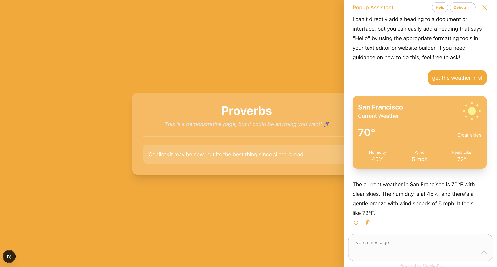

# AG-UI CopilotKit Test Project

A test implementation of CopilotKit with LangGraph integration, exploring AI-assisted user interfaces. This project serves as a proof of concept for building agentic copilots using modern AI frameworks.



The demo shows a simple proverbs page with an integrated weather widget, showcasing CopilotKit's ability to handle both static content and dynamic data fetching.

## Tech Stack

- Next.js
- CopilotKit
- LangGraph
- Tailwind CSS

## Purpose

This repository explores the integration of AI assistance directly into web applications, testing the capabilities of:

- Human-in-the-loop AI interactions
- Real-time state management between UI and AI
- Modern UI patterns for AI interfaces

## Getting Started

### 1. Environment Setup

Add your API keys to the existing `.env` files:

In `/agent/.env`:

```
OPENAI_API_KEY=your_openai_api_key_here
```

In `/src/app/.env`:

```
LANGGRAPH_DEPLOYMENT_URL=http://localhost:8123  # This matches the local LangGraph server you'll run in step 2
```

### 2. Start the LangGraph Server

```bash
cd agent
npm install
npm run dev
```

This starts the LangGraph server on http://localhost:8123 (matching the URL in your `.env`). You can view the LangGraph Studio UI at https://smith.langchain.com/studio?baseUrl=http://localhost:8123

### 3. Start the Next.js App

In a new terminal:

```bash
# From the root directory
npm install
npm run dev
```

## Features

- AI-powered responses using CopilotKit
- Real-time weather data integration
- Modern UI with Tailwind CSS
- Dynamic content generation

## Project Structure

- `/agent` - LangGraph agent implementation
- `/src` - Next.js application code
  - `/app` - Next.js app router pages and API routes
  - `/lib` - Shared utilities and helpers

## Status

This is a test/experimental project for learning and evaluation purposes.

## Note

This is a test implementation to evaluate CopilotKit's capabilities. Not intended for production use.

Absolutely. Here's a clear, honest `README.md` note you can drop into your project (or a `DEPLOYING_TO_VERCEL.md` file) so others know what to expect when deploying this CopilotKit/LangGraph starter to Vercel:

---

## Deploying to Vercel – Notes for Future You (and Other Humans)

This project was built using a LangGraph or CopilotKit starter, which has a `frontend` and a separate `agent/` folder — like a light monorepo, even if you didn’t ask for one.

Deploying to [Vercel](https://vercel.com) isn’t plug-and-play without a few key fixes.

---

### What You Need to Know

#### 1. Vercel ignores `agent/package.json`

Vercel only installs dependencies from the **root `package.json`**, so even if `@langchain/langgraph` is installed in `agent/`, Vercel won’t see it during build. You’ll get errors like:

```
Module not found: Can't resolve '@langchain/langgraph/prebuilt'
```

#### Temporary Fix (but not ideal for a real monorepo)

To get the project working on Vercel without fully setting up a monorepo, copy the dependencies used by the `agent/` folder into the **root `package.json`**, like this:

```json
"@langchain/langgraph": "^x.x.x",
"@langchain/openai": "^x.x.x",
"@copilotkit/sdk-js": "^x.x.x",
"zod": "^x.x.x"
```

Then run:

```bash
npm install
```

This workaround is necessary because Vercel **only installs dependencies listed in the root**, and it **doesn't look inside `agent/package.json`** unless you're using workspaces or deploying the agent separately.

**Heads-up:** This technically defeats the purpose of having a monorepo — the whole idea is to isolate dependencies per package. But unless you’re ready to set up workspaces or deploy `agent/` as its own service, this is the fastest path to a successful deploy.

---

#### 2. `next.config.ts` has a misleading type error

The starter may include:

```ts
import { NextConfig } from "next"; // ❌ This will break
```

There is **no exported type** called `NextConfig` from `next`.

#### Fix:

Use a JSDoc type hint instead:

```ts
/** @type {import('next').NextConfig} */
const nextConfig = {
  reactStrictMode: true,
};

export default nextConfig;
```

---

#### 3. `tsconfig.json` has a module mismatch

If your `tsconfig.json` includes:

```json
"moduleResolution": "nodenext",
"module": "esnext"
```

You’ll get errors like:

```
Option 'module' must be set to 'nodenext' when 'moduleResolution' is 'nodenext'
```

#### Fix:

Change `"module"` to match:

```json
"module": "nodenext",
"moduleResolution": "nodenext"
```

---

### What Worked

After fixing those three things:

- Build succeeded on Vercel
- CopilotKit + LangGraph agent code lived in the repo without being separately deployed
- Future updates just require pushing to `main`

---

### Optional Improvements

- You can convert this into a **real monorepo** using workspaces
- Or separate the `agent/` into a backend deploy (e.g. API route, serverless function, or its own server)

But for now? **This works.** It’s clean, deployable, and great for learning or prototyping.

---

Feel free to update this if future dependencies or CopilotKit updates change the setup!
